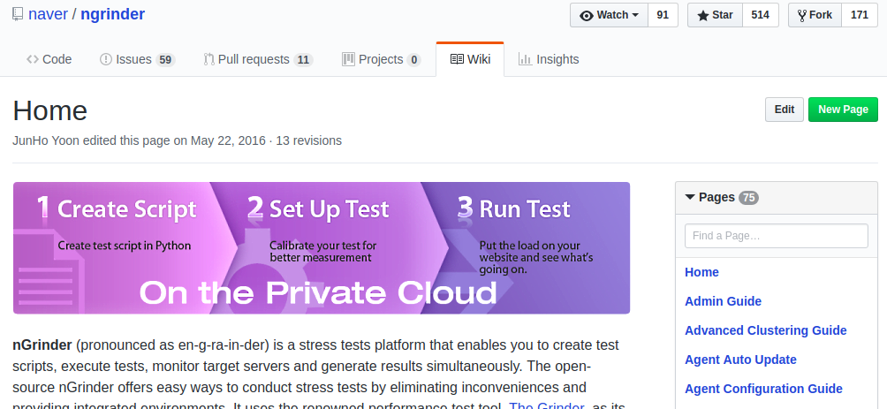
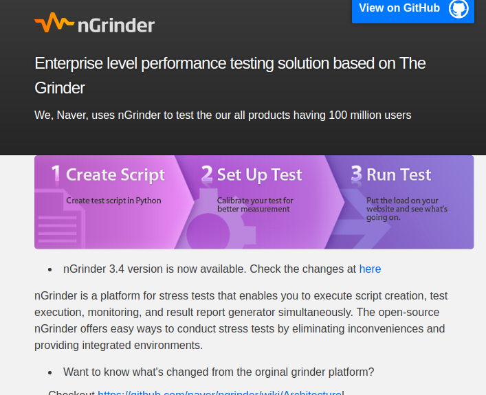

# 오픈소스 프로젝트 개발 및 기여하기

## 기여 할 오픈소스 프로젝트 선택의 예

- 관심이 있거나 써본 적 있는 오픈소스 소프트웨어 (생산성 도구, OS, IDE 등)
- 개발하면서 사용해 본 적이 있는 오픈소스 라이브러리 혹은 프레임워크
  > 라이브러리나 프레임워크 사용 시에 불편했던 점이나 필요했던 기능을 추가하는 시도를 해볼 수 있습니다. 직접 사용해 본 경험을 가지고 있기 때문에 문서나 기능 개선에 있어서 아이디어를 많이 낼 수 있습니다.
- 개발하면서 사용해 본 적이 있는 오픈소스 개발 플러그인
  > 이클립스나 VS Code 등의 플러그인, 자신이 사용해 본 언어, 개발 프레임워크 등과 관련된 단축키 혹은 자동화를 추가하는 간단한 코드부터 시작해 볼 수 있습니다.

## 개발 참여하기

### 문서화 기여

- 프로젝트가 어떤 방식으로 문서화를 하고 있는지 파악하여 해당 방식에 따라 기여 방법이 달라집니다. 각 프로젝트마다 여러 문서화 방식을 가지고 있을 수 있고, 용도에 따라 구분할 수 있습니다. GitHub Wiki는 개발자용으로, GitHub Pages는 개발자겸 사용자 대상으로 쓰이는 경향이 있습니다.

#### Wiki

GitHub 저장소의 "Wiki" 탭에서 볼 수 있습니다. 저장소 관리자가 비활성화하면 보이지 않습니다. 일반적으로 해당 저장소에 Push 권한이 있는 사람이 수정할 수 있습니다. 저장소에 따라 누구나 수정할 수 있는 위키도 있습니다. 수정하고 싶은데 권한이 Issues에 관련 내용을 등록하거나 (만약 있다면)Contribution 가이드라인에 따라 수정을 요구할 수 있습니다.

#### GitHub Pages

GitHub 저장소의 gh-pages 브랜치나 "docs" 디렉토리에 웹페이지 형식으로 문서화 할 수 있습니다. GitHub 저장소의 코드 수준으로 저장되고 이는 Push 권한이 반드시 필요합니다. Pull Request를 통해서 수정사항을 직접 보낼 수 있습니다.

#### 외부 문서화 서비스

- readthedocs
- ...

### 실행 및 디버깅 환경 구축, 사용해보기

- README 확인. 본인이 기여하는 환경에서 빌드 및 실행해야 디버깅 가능

### 개발 참여 가이드 여부 확인하기

- README 등 확인, 이슈 관리와 패치 작성 방법 및 리뷰 프로세스

### 패치 작성 시 주의사항

- 패치를 작성하였으면 해당 패치가 정상적으로 동작하는지 최소한의 확인 과정을 거치는 것이 기본입니다. 만약 기능을 추가하는 패치라면 추가된 기능에 대한 테스트를 패치에 포함하여 제출하는 것이 좋습니다.

---

### 참고자료

[https://naver.github.io/OpenSourceGuide/book/index.html](https://naver.github.io/OpenSourceGuide/book/index.html)
> 네이버 오픈소스 가이드, 국문

[https://opensource.guide/](https://opensource.guide/)
> Open Source Guides, 영문
