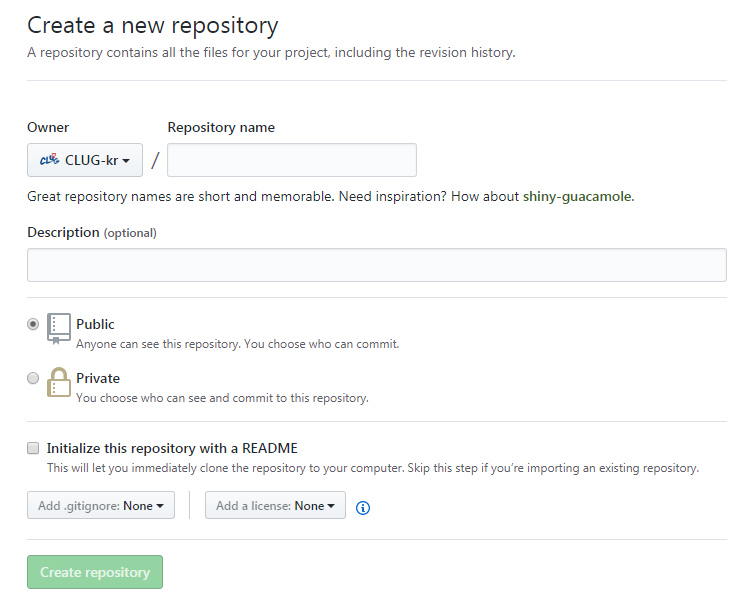

# GitHub 사용 가이드

## 1. 회원가입

1. [https://github.com/](https://github.com/) 접속
2. Username, Email, Password 입력 후 `Sign up for GitHub` 클릭

## 2. 프로젝트 생성

1. 화면 우측 `New repository` 클릭
2. `Owner` 확인 후 `Repository name`에 프로젝트 이름 기입 후 `Create repository` 클릭

## 3. 소스코드 올리기

1. 올릴 소스코드를 `git commit` 형태로 준비
2. 프로젝트 메인 페이지의 Quick setup 항목에서 HTTPS 클릭하여 `https://`로 시작하는 주소 복사

3. `git remote add origin https://...` 명령어로 주소 추가
4. `git push -u origin master` 명령어로 현재 commit 푸시 ([`git push` 실패 시 체크리스트](notices-to-use-git-on-laboratory-pc.html#2-git-push-실패-시-permission-denied))

## 4. 콜라보레이터 추가

1. 프로젝트 메인 페이지에서 `settings` 클릭
2. 왼쪽 항목 중 `collaborators` 클릭
3. 콜라보레이터 입력창에 아이디 혹은 이메일 주소 입력하여 추가

## 5. 소스코드 내려받기

TBA
