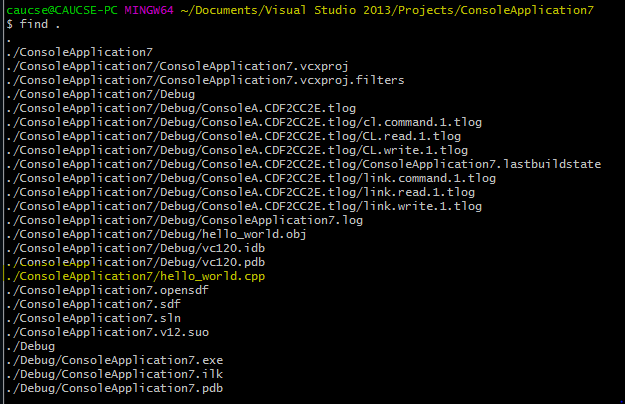

# Visual Studio 프로젝트 업로드 하기

## git bash 열기

바탕화면의 를 찾아 열거나, 없을 경우 공식 홈페이지에서 다운로드([바로가기 링크](https://git-scm.com/downloads))하여 설치합니다.

## Visual Studio 프로젝트 폴더로 이동

1. `cd` 명령어를 통해 내가 작성한 프로젝트 폴더로 이동합니다.

   

2. `find` 명령어로 업로드 할 파일이 있는지 확인합니다. 스크린샷은 ConsoleApplication7이라는 이름의 프로젝트의 hello_world.cpp 파일을 작성했을 때 나오는 결과입니다.
   
   

## `.gitignore` 파일 설정

- 버전 관리를 효과적으로 하기 위해서는 모든 파일을 올리는 것보다 꼭 필요한 파일만 관리하고 나머지는 무시하는 것이 좋습니다. `.gitignore` 파일에 디렉토리 이름이나 파일 이름을 적어서 Git 최상위 디렉토리에 저장해두면 해당 파일이나 디렉토리는 git에서 추적하거나 저장하지 않습니다. [https://gitignore.io/](https://gitignore.io/)는 프로젝트 설정에 따라 미리 만들어진 `.gitignore` 파일을 제공합니다.

   
   
1. Visual Studio 프로젝트 폴더에서 아래 `curl` 명령어를 수행합니다. 아래 명령어를 통해 Visual Studio 용으로 미리 만들어진 `.gitignore` 파일을 저장합니다

   > `curl https://www.gitignore.io/api/visualstudio > .gitignore`
   
   

## `git add`, `git commit` 명령어로 업로드 할 파일 추가

1. `git add .` 명령어를 통해 무시할 파일 외의 모든 파일을 Git에 올립니다.
2. `git commit` 명령어를 통해 `git add`로 올려진 파일을 패치로 확정짓습니다. commit 단위로 GitHub 저장소에 업로드가 가능합니다.
    
    

- `&&`는 순차처리를 의미합니다. `git add . && git commit ...` 명령어는 `git add .`를 수행하여 성공할 경우 `git commit ...`를 수행 합니다.

- git commit이 실패할 경우 commit 작성자 설정이 있는지 확인하세요. 아래 명령어를 통해 추가할 수 있습니다.
  > `git config --local user.name "your name here"`
  >
  >  `git config --local user.email "your@email.here"`

    

